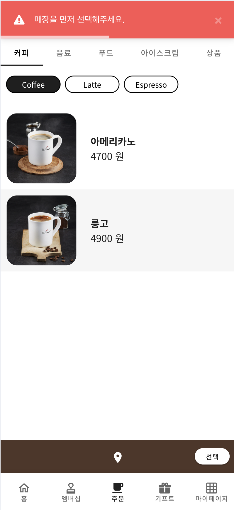
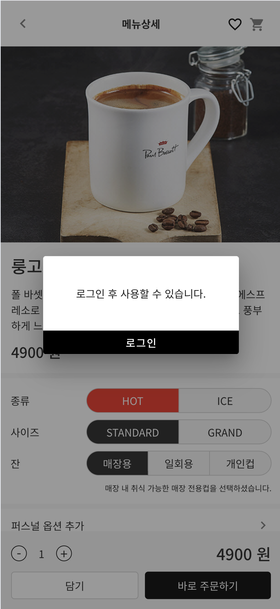
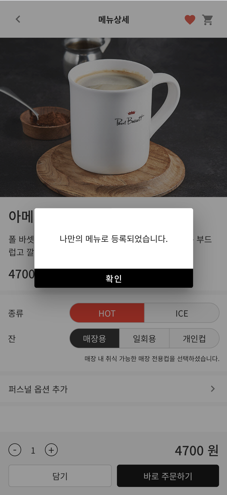
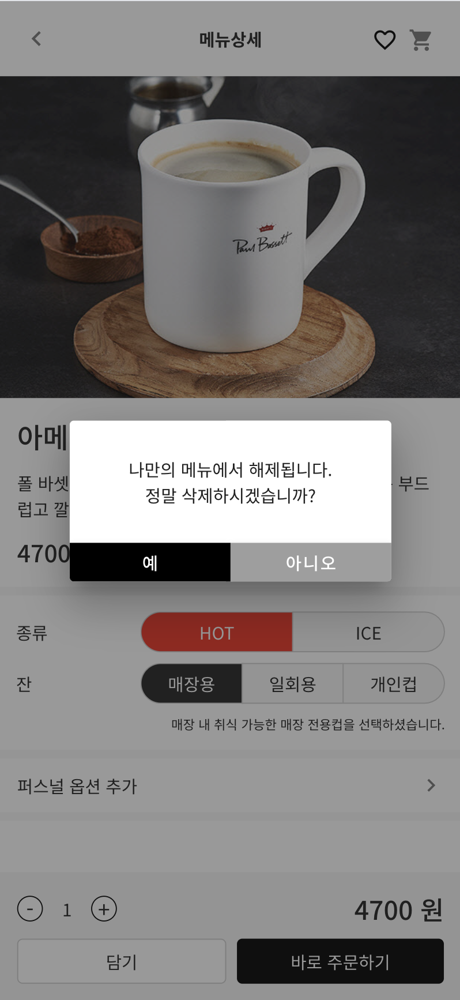
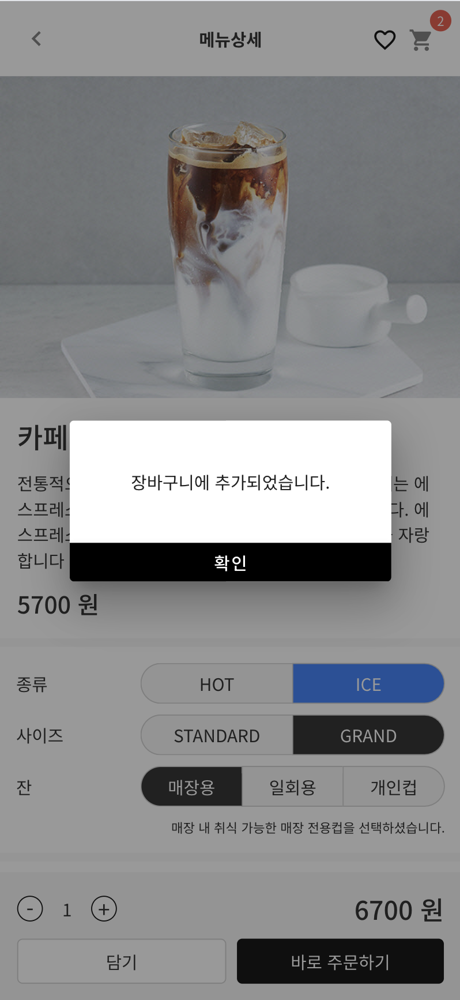

# 👑 Paul Basset Team Project

- 팀원 : 이하은, 장민주, 예이원, 이정은 
- 개발 기간 : 2024.07.26 ~ 2024.08.14
- 분류 : 팀프로젝트
  
### 배포 주소 : https://paulbassett-42763.web.app/

### 발표 자료 피피티 

[pdf 파일](폴바셋리뉴얼.pdf)

[ppt 파일](폴바셋리뉴얼.pptx)

## 📌 목차

<b>

- [👑 Paul Basset Team Project](#-paul-basset-team-project)
    - [배포 주소 : https://paulbassett-42763.web.app/](#배포-주소--httpspaulbassett-42763webapp)
    - [발표 자료 피피티](#발표-자료-피피티)
  - [📌 목차](#-목차)
  - [⚒️ 사용 기술](#️-사용-기술)
  - [💡 기획](#-기획)
    - [기획 의도](#기획-의도)
    - [🍎 주색](#-주색)
  - [⚒️ 본인 맡은 파트](#️-본인-맡은-파트)
  - [📝 로그인 전 및 메뉴리스트 매장선택에서 디테일 페이지까지](#-로그인-전-및-메뉴리스트-매장선택에서-디테일-페이지까지)
  - [❤️ 나만의 메뉴 등록 (즐겨찾기 메뉴)](#️-나만의-메뉴-등록-즐겨찾기-메뉴)
    - [메뉴 디테일 페이지에서의 모습](#메뉴-디테일-페이지에서의-모습)
    - [나만의 메뉴 목록 페이지에서의 모습](#나만의-메뉴-목록-페이지에서의-모습)
  - [📝 바로 주문 \& 장바구니 주문](#-바로-주문--장바구니-주문)
  - [📝 결제 후 주문내역 \& 적립](#-결제-후-주문내역--적립)
  
</b>

---

## ⚒️ 사용 기술

**디자인 작업**

 

**데이터, 서버, 프레임워크**

**검색 활용**

  

**사용 에디터 & 협업**

   
  

---

## 💡 기획

### 기획 의도 

폴바셋 어플의 불편함과 올드한 디자인을 리뉴얼하고자 Vue.js 프로젝트를 진행함.

### 🍎 주색 

  

기존 앱의 주조색으로 사용되던 Dark Brown이 올드한 느낌을 주어 메인 색상을 블랙, 화이트로 변경.  
전체적인 주조색 및 보조색 사용 비율을 조정하고 기존 색상에서 채도를 조금씩 변경.  
전체적으로 깔끔하고 가독성이 좋으며, 고급스러운 느낌을 강조함.

## ⚒️ 본인 맡은 파트

- JSON 방식 메뉴 데이터 구축과 메뉴마다 다른 옵션 설정
- 메뉴 리스트 카테고리 별로 출력
- [📌매장 선택 후 주문 기능](#-로그인-전-및-메뉴리스트-매장선택에서-디테일-페이지까지)
- [📌메뉴 좋아요 기능](#️-나만의-메뉴-등록-즐겨찾기-메뉴) 
- [📌장바구니와 바로주문 기능](#-바로-주문--장바구니-주문) 
- [📌주문 후 주문 내역과 멤버십 적립](#-결제-후-주문내역--적립)

## 📝 로그인 전 및 메뉴리스트 매장선택에서 디테일 페이지까지 

  
  
  
  

## ❤️ 나만의 메뉴 등록 (즐겨찾기 메뉴)

### 메뉴 디테일 페이지에서의 모습

  
  

### 나만의 메뉴 목록 페이지에서의 모습
  
  
  

## 📝 바로 주문 & 장바구니 주문

  
  

  
  

## 📝 결제 후 주문내역 & 적립 

  
  
  

